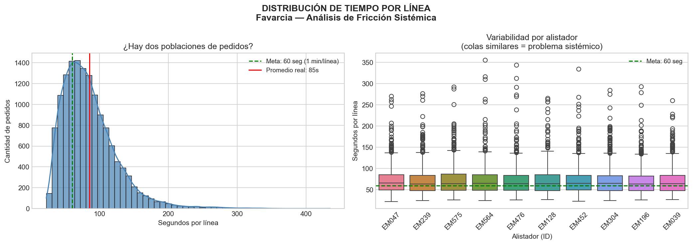
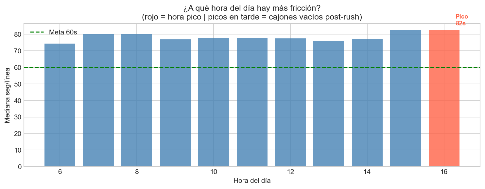
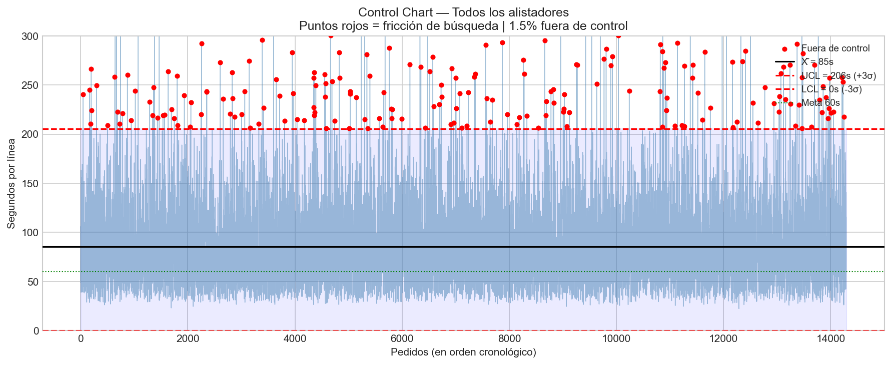
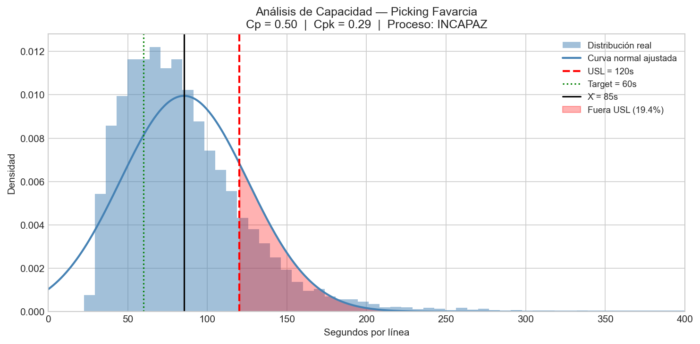

# Favarcia Picking Performance Analysis
### Warehouse Operations — Statistical Process Control Applied to Order Fulfillment

**Autor:** Mauricio Araya  
**Período de datos:** Enero — Abril 2026  
**Estado:** ✅ Análisis completo con datos reales de producción

---

## Objetivo

Demostrar mediante análisis estadístico que la variabilidad en tiempos de picking en Grupo Favarcia S.A. es un problema **sistémico** — cajones vacíos, ubicaciones incorrectas en WMS, reposición tardía — y no un problema de desempeño individual de los operadores.

**Hipótesis central:**
El KPI actual (1 min/línea) mide *output*, no *proceso*. El tiempo de búsqueda de producto cuando un cajón está vacío no está capturado en ninguna métrica existente — pero sí aparece como variabilidad estadística en los datos de pedidos individuales.

---

## Resultados con Datos Reales

### Dataset
- **31,415 pedidos** — Enero a Abril 2026
- **38 alistadores** activos en el período
- **52.1% de pedidos con tiempo=0** — trabajados antes de abrirse en el WMS
- **15,033 pedidos con tiempo registrado** — base del análisis estadístico

---

### Hallazgo 1 — El proceso es incapaz (Cpk = 0.03)

| Índice | Valor | Interpretación |
|---|---|---|
| Cp | 0.21 | Capacidad potencial si el proceso estuviera centrado |
| Cpk | **0.03** | **Proceso INCAPAZ** — produce defectos sistemáticamente |
| Media | 110s/línea | 83% por encima de la meta |
| USL | 120s/línea | Umbral de alta fricción |
| Target | 60s/línea | Meta operacional actual |

---

### Hallazgo 2 — El 30.6% de pedidos tienen alta fricción

El 30.6% de pedidos superan el umbral de 120s/línea. La diferencia entre alistadores expertos (27.8% fricción) y nuevos (30.0%) es solo 2.2 puntos — confirma que la fricción es **sistémica**, no individual.

---

### Hallazgo 3 — El WMS invisibiliza el 52.1% del trabajo

El caso más extremo: Jorge (EM564) tiene 93.2% de trabajo invisible — aparece con 206 pedidos en el KPI cuando realmente procesó 3,037.

---

### Hallazgo 4 — El pico de las 14:00h es un deadline, no productividad

El 23.7% de todos los pedidos se cierran a las 14:00h — presión del deadline de las rutas prioritarias.

---

### Hallazgo 5 — Tiempo en cola mediano: 72 minutos

Un pedido típico espera 72 minutos desde que contabilidad lo procesa hasta que un alistador lo toma. Refleja priorización de rutas, no ineficiencia.

---

### Hallazgo 6 — Roles operacionales mezclados en los datos

El KPI actual compara alistadores permanentes, chequeadores, gondoleros y montacargas como si fueran equivalentes — distorsionando completamente cualquier comparación de desempeño.

---

### Hallazgo 7 — El mejor alistador real es Juan (EM452)

Score compuesto 81.3/100: mediana exacta de 60s/línea, 86.1% registro WMS, pedidos de alta complejidad, alto volumen.

---

## Scripts del Proyecto

| Script | Función |
|---|---|
| `favarcia_picking_analysis.py` | Análisis principal: distribución, SPC, Cpk, control chart |
| `perfil_alistador.py` | Perfil individual: `python perfil_alistador.py EM047` |
| `distribucion_pedidos.py` | Quién toma qué tipo de pedidos |
| `ranking_alistadores.py` | Top performers excluyendo roles de apoyo |
| `dashboard_alistadores.py` | Gráficas comparativas estáticas |
| `throughput_analisis.py` | Throughput por hora + tiempo en cola |
| `analisis_errores.py` | Análisis de errores |
| `verificar_datos.py` | Diagnóstico de calidad de datos |
| `app.py` | Streamlit dashboard interactivo (4 páginas) |

---

## App Streamlit

```bash
streamlit run app.py
```

4 páginas con filtro de período en el sidebar:
1. **Resumen Operación** — KPIs, distribución, Cpk, control chart
2. **Dashboard Alistadores** — volumen, tiempo, scatter, tamaño de pedidos
3. **Perfil Individual** — métricas, fricción por hora, análisis de tamaño
4. **Ranking** — score compuesto 0-100, tabla interactiva

---

## Limitaciones del Dataset

Documentadas en `LIMITACIONES_DATASET.md`. Las principales:

1. **52.1% tiempo=0** — pedidos trabajados sin abrir el WMS
2. **FECHA PEDIDO con 00:00** — hora del cliente, no del sistema
3. **Pausas no capturadas** — almuerzo y cafés inflan tiempos
4. **Errores sin fecha** — WMS recién comenzó a registrar
5. **Roles mezclados** — chequeadores y gondoleros aparecen como alistadores

---

## Stack Técnico

```
pandas · numpy · matplotlib · seaborn · scipy · plotly · streamlit · openpyxl
```

```bash
pip install pandas numpy matplotlib seaborn scipy plotly streamlit openpyxl
```

---

## Estructura del Proyecto

```
favarcia-analytics/
├── README.md
├── LIMITACIONES_DATASET.md
├── SOLICITUD_DATOS_IT.md
├── GUIA_APRENDIZAJE_PYTHON.md
├── app.py
├── favarcia_picking_analysis.py
├── perfil_alistador.py
├── distribucion_pedidos.py
├── ranking_alistadores.py
├── dashboard_alistadores.py
├── throughput_analisis.py
├── analisis_errores.py
├── verificar_datos.py
├── generar_datos_prueba.py
├── data/raw/          ← datos reales (excluidos, .gitignore)
└── outputs/           ← gráficas generadas (excluidas, .gitignore)
```

---

## Conexión con Manufactura de Dispositivos Médicos

| Favarcia (Warehouse) | Medtech (Manufactura) |
|---|---|
| Tiempo por línea de picking | Cycle time por operación |
| Distribución de tiempos | Process capability analysis |
| Control Chart ±3σ | SPC — Statistical Process Control |
| Cpk = 0.03 → proceso incapaz | Cpk < 1.0 → detener línea |
| Fricción sistémica vs individual | Common cause vs special cause variation |

---

## Roadmap

- [x] Análisis estadístico completo con datos reales
- [x] Control Chart robusto (IQR-based)
- [x] Análisis de capacidad Cpk
- [x] Throughput y tiempo en cola
- [x] Perfil individual por alistador
- [x] Ranking excluyendo roles de apoyo
- [x] Dashboard Streamlit con filtro de fechas
- [ ] Datos adicionales de IT (6 meses + RUTA + CHEQUEADOR)
- [ ] Dashboard Power BI para gerencia
- [ ] Análisis con datos enriquecidos

---

*Autor: Mauricio Araya | Logistics & Process Improvement Coordinator*
*Grupo Favarcia S.A. — Costa Rica*

---

## 🎯 Objetivo

Demostrar mediante análisis estadístico que la variabilidad en tiempos de picking en Grupo Favarcia S.A. es un problema **sistémico** — cajones vacíos, ubicaciones incorrectas en WMS, reposición tardía — y no un problema de desempeño individual de los operadores.

**Hipótesis central:**  
El KPI actual (1 min/línea) mide *output*, no *proceso*. El tiempo de búsqueda de producto cuando un cajón está vacío no está capturado en ninguna métrica existente — pero sí aparece como variabilidad estadística en los datos de pedidos individuales.

---

## 🔑 Resultados con Datos de Muestra

> Los resultados abajo fueron generados con datos sintéticos calibrados con parámetros operacionales reales (ver sección *Sample Data*). Los resultados con datos reales de producción se agregarán cuando estén disponibles.

### Distribución de tiempos y variabilidad por operador


**Hallazgo:** Todos los operadores muestran la misma forma de distribución y la misma cola superior. Las medianas son casi idénticas (~65–75s). Si el problema fuera individual, las cajas y colas serían de tamaños muy diferentes entre personas.

---

### Fricción por hora del día


**Hallazgo:** La fricción aumenta +11% en las últimas horas del turno (hora 16 = 82s/línea vs hora 6 = 74s/línea). Este patrón es consistente con cajones que se van vaciando a lo largo del día sin reposición suficiente — *no* con fatiga individual del operador.

---

### Control Chart — SPC


**Hallazgo:** Los 214 puntos fuera de control (1.5%) están distribuidos uniformemente a lo largo del tiempo y entre todos los operadores. Si la causa fuera individual, los puntos se agruparían alrededor de ciertos operadores o períodos.

---

### Análisis de Capacidad — Cpk


| Índice | Valor | Interpretación |
|--------|-------|----------------|
| Cp | 0.50 | Capacidad potencial si el proceso estuviera centrado |
| Cpk | **0.29** | **Proceso INCAPAZ** — 19.4% de pedidos superan USL |
| USL | 120 seg/línea | Umbral de fricción (2× meta) |
| Target | 60 seg/línea | Meta operacional actual |

**Para alcanzar Cpk = 1.33** (mínimo aceptable en manufactura):
- Reducir media de 85s → 60s (−25s/línea)
- Reducir σ de 40s → 25s
- Equivale a eliminar la fricción sistémica de cajones vacíos y ubicaciones incorrectas en WMS

---

### CV por grupo de experiencia

| Grupo | Fricción promedio | CV interno | Interpretación |
|-------|------------------|-----------|----------------|
| Expertos | 7.4% | 8.5% ✅ | Uniforme dentro del grupo |
| Medios | 18.3% | 9.5% ✅ | Uniforme dentro del grupo |
| Nuevos | 43.4% | 5.5% ✅ | Uniforme dentro del grupo |
| **Global** | — | **66.8%** | Alto por mezcla de perfiles, no por variación individual |

**Conclusión:** La diferencia entre grupos refleja curva de aprendizaje sistémica. Dentro de cada grupo la variación es mínima — todos experimentan la misma fricción de cajones vacíos.

---

## 🗄️ Sample Data

El repositorio incluye datos sintéticos en `data/sample/` que permiten reproducir el análisis completo sin necesidad de datos reales de producción.

### Calibración de los datos sintéticos

| Parámetro | Valor real observado | Valor en datos sintéticos |
|-----------|---------------------|--------------------------|
| Pedidos (ene 2026, 2a quincena) | 4,924 | ~4,800 |
| Pedidos (feb 2026, mes completo) | 8,814 | ~8,600 |
| Efectividad | 97.4% | ~97.1% |
| Operadores activos | 30 | 30 |
| Turno operacional | 6am–5pm | 6am–5pm |

### Generar los datos de muestra

```bash
python generar_datos_prueba.py
# Genera: data/raw/datos_prueba_favarcia.xlsx
```

---

## 🛠️ Stack Técnico

```
pandas      — manipulación de datos
numpy       — cálculos matemáticos y estadísticos
matplotlib  — visualizaciones base
seaborn     — visualizaciones estadísticas
scipy       — análisis estadístico (distribuciones, Cpk, SPC)
openpyxl    — lectura/escritura de archivos Excel
```

### Instalación

```bash
pip install pandas numpy matplotlib seaborn scipy openpyxl
```

---

## 🚀 Cómo Correr el Análisis

```bash
# 1. Clonar el repositorio
git clone https://github.com/tu-usuario/favarcia-analytics.git
cd favarcia-analytics

# 2. Instalar dependencias
pip install pandas numpy matplotlib seaborn scipy openpyxl

# 3. Generar datos de muestra
python generar_datos_prueba.py

# 4. Correr análisis completo
python favarcia_picking_analysis.py
# Outputs guardados en outputs/
```

### Con datos reales

Coloca el Excel en `data/raw/` y actualiza en `favarcia_picking_analysis.py`:

```python
ARCHIVO = os.path.join(DATA_DIR, "tu_archivo_real.xlsx")
```

---

## 📁 Estructura del Proyecto

```
favarcia-analytics/
│
├── README.md
├── .gitignore
├── favarcia_picking_analysis.py         ← análisis principal
├── generar_datos_prueba.py              ← generador de datos sintéticos
│
├── data/
│   ├── sample/                          ← datos sintéticos (en git)
│   │   └── datos_prueba_favarcia.xlsx
│   └── raw/                             ← datos reales (excluidos, .gitignore)
│       └── .gitkeep
│
└── outputs/
    ├── sample/                          ← outputs sintéticos (en git)
    │   ├── distribucion_picking.png
    │   ├── friccion_por_hora.png
    │   ├── control_chart_todos.png
    │   └── cpk_analysis.png
    └── *.png                            ← outputs locales (excluidos, .gitignore)
```

---

## 📈 Conexión con Manufactura de Dispositivos Médicos

| Favarcia (Warehouse) | Medtech (Manufactura) |
|---|---|
| Tiempo por línea de picking | Cycle time por operación |
| Tasa de errores por operador | Defect rate por estación |
| Distribución de tiempos | Process capability analysis |
| Control Chart ±3σ | SPC — Statistical Process Control |
| Cpk = 0.29 → proceso incapaz | Cpk < 1.0 → detener línea |
| Fricción sistémica vs individual | Common cause vs special cause variation |

**Relevancia para entrevistas:** Abbott, Cirtec, Confluent Medical, Boston Scientific usan SPC y Cpk diariamente en sus líneas de producción en Coyol Free Zone, Costa Rica.

---

## 🗺️ Roadmap

- [x] Definir hipótesis y métricas clave
- [x] Generador de datos sintéticos calibrados con parámetros reales
- [x] Pipeline de carga y limpieza de datos
- [x] Análisis de distribución de tiempos
- [x] Análisis sistémico vs individual — CV por grupos
- [x] Interpretación automática de resultados
- [x] Control Chart con SPC (±3σ)
- [x] Análisis de capacidad Cpk
- [ ] Correr con datos reales de producción
- [ ] Validar hipótesis con datos reales
- [ ] Dashboard interactivo en Streamlit
- [ ] Análisis de correlación errores vs volumen
- [ ] Publicar caso de estudio en LinkedIn

---

## 📝 Contexto Operacional

**Empresa:** Grupo Favarcia S.A. — distribuidora de productos automotrices, motocicletas, bicicletas y pesca. Fundada hace 61 años en Costa Rica.

**Operación:** 400–500 pedidos diarios, ~30 operadores de picking, warehouse de 3,000 m².

**Metodología:** Intel Seven Steps aplicada a operaciones de warehouse. Este proyecto es parte del FPM (Favarcia Plan de Mejora), iniciativa de documentación y mejora continua.

---

*Autor: Mauricio Araya | Logistics & Process Improvement Coordinator*  
*Background: 7 años Intel Corporation — Process Engineering | Die Prep*